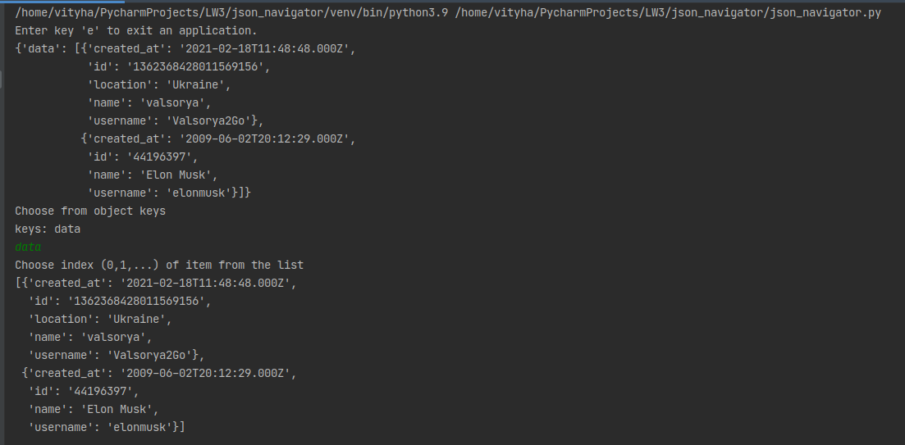

# JSON Navigator

JSON Navigator is a Python module for navigating through Twitter's JSON object.

## Description

The module allows navigating through JSON object in CL interface with entering particular keys.

## Usage

```bash
json_navigator.py
```

